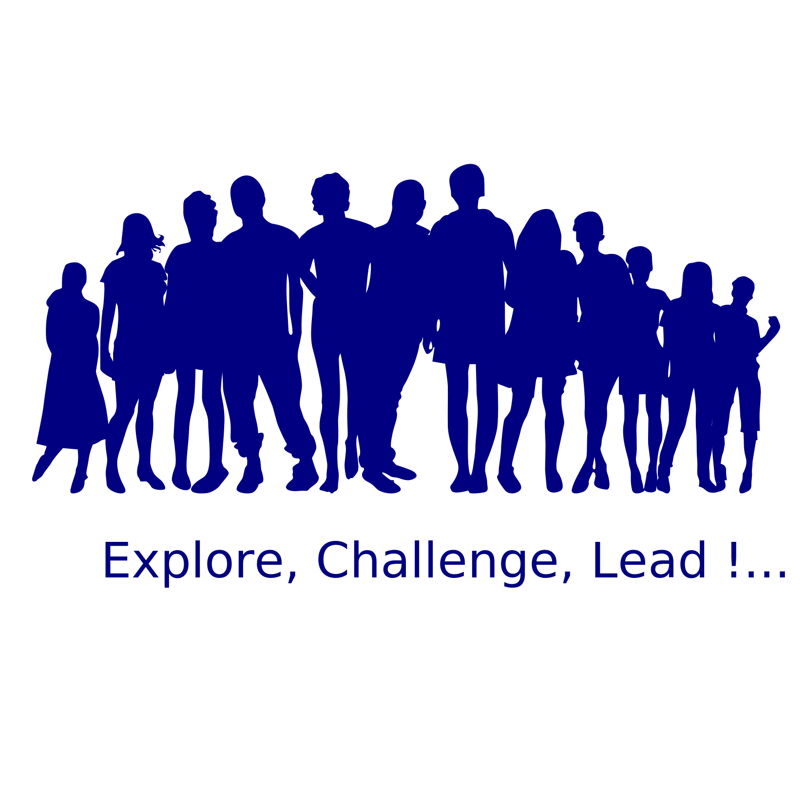

# Hi there 👋

We QB Networks and Masscollabs Services are leading to Software, Hardware and Science for the Internet Cyberspace with our own consciousness. We have our own roadmap and which is why we say we are a Free Software project. This is an open way to software and open infrastructures ...

QB Networks is a Free Software company which is holding and maintaining [Masscollabs Services](https://www.masscollabs.xyz) and its subprojects ...

* [QB Networks](https://qbnetworks.xyz)
* [Masscollabs Services](https://masscollabs.xyz)
* [Procyberian Systems Distribution](https://procyberian.xyz)
* [Mass Collaboration Labs](https://masscollaborationlabs.xyz)
* [amassivus](https://amassivus.xyz)
* [Go Digitalist](https://godigitalist.xyz)
* [Bilsege](https://bilsege.xyz)
* [Birleşik Dergi](https://birlesik.xyz)
* [exsay social media](https://www.exsay.xyz/)
* [Açık Ağ Platformu( Open Network Platform)](https://www.acikag.xyz/)
* [Kernel R&D](https://cekirdek.xyz/)

## QB Networks Ethics Declaration — *Principles with Inspirational Notes*

## 1. **Human Dignity is Fundamental**
We consider human dignity as the center of all our activities. Technology, data, software or decision solutions can never surpass humanity.

*“No idea that does not defend humanity is legitimate.”* — **Aliya Izetbegovic**

## 2. **Ethical Leadership Comes from Responsibility, Not Authority**
We believe in a leadership approach that derives its decision-making power not from above, but from principle and accountability.

*“A leader who underestimates his people is the grave digger of the country.”* — **Aliya Izetbegovic**

## 3. **Pluralism is Strength**
Different voices and disciplines, is not a conflict  but a wealth for us. We believe in listening and unifying dialogues.
*“Differences are a law of God. To respect them is to be human.”* — **Aliya Izetbegovic**

## 4. **Open Knowledge is a Common Wealth**
Knowledge is a trust to be shared, not hidden. Openness is not only access, but also *virtuous production*.

*“When knowledge ceases to be power and is combined with virtue, then civilization becomes.”* — **Aliya Izetbegovic**

## 5. **Consultation with Society Combines with Decision**
Every final decision may be in the hands of the founder, but the process is shaped by community. We want to build decision structures that is based on mutual learn, document and are open to contribution.

*“Freedom is the right of only those who are willing to listen to others.”* — **Aliya Izetbegovic**

## 6. **Balance of Freedom and Responsibility**
For us, freedom is not lack of discipline, but a part of responsibility. We observe this balance both in code and in relationships.

*“Man is free, but not irresponsible. Freedom without responsibility is anarchy.”* — **Aliya Izetbegovic**

## 7. **Digital Justice and Accessibility**
We design our technological solutions in a way that every individual can access. Justice begins digitally, we produce inclusivity, not discrimination.

*“No justice is complete unless justice reaches everyone.”* — **Aliya Izetbegovic**

## 8. **Principle Comes Before Profit**
Profit can never take precedence over principle. Production without ethical compromise is our definition of sustainability.

*“Profit without morality is another form of destruction.”* — **Aliya Izetbegovic**

This structure represents not only the technical, but also the universal and human aspect of QB Networks.

## Free Software is all about Freedom of Speech

Please visit [https://www.gnu.org/philosophy/free-sw.html](https://www.gnu.org/philosophy/free-sw.html)

## The four essential freedoms

A program is free software if the program's users have the four essential freedoms: 

* The freedom to run the program as you wish, for any purpose (freedom 0).

* The freedom to study how the program works, and change it so it does your computing as you wish (freedom 1). Access to the source code is a precondition for this.

* The freedom to redistribute copies so you can help others (freedom 2).

* The freedom to distribute copies of your modified versions to others (freedom 3). By doing this you can give the whole community a chance to benefit from your changes. Access to the source code is a precondition for this.

## Our approach to sponsors and partners

We ofcourse like to be partners with sponsors or other organizations that who want to get in touch with us. But our choice is "Free Software Business Model" and we only accept organizations for sponsorship who will write Free Software with us. And also we only accept organizations that we can give technical support and other Free Software services to them...

Thanks for your understanding.

happy hacking !

## Security & Abuse Team

We have been initialized our Abuse Team Email and it is abuse at qbnetworks dot xyz and our GPG Key ID: 0xA45FAA3685170E38 for encrypted emails.

QB Networks Abuse Technical Support Account

Run Free Software and Please do stay safe

happy hacking !

## Our Location

Our domains are hosted in the [DalNet](https://www.dal.net.tr/) data center.

Our [Masscollabs Services Forgejo Instance](https://source.masscollabs.xyz) is sponsored by [Plusclouds](https://plusclouds.com/us)

## License

QB Networks official GitHub README repository

Copyright (C) 2024-2025 QB Networks

Copyright (C) 2017-2025 Masscollabs Services

Copyright (C) 2017-2025 Procyberian and contributors

Copyright (C) 2017-2025 Mass Collaboration Labs and contributors

Copyright (C) 2017-2025 amassivus and contributors

Copyright (C) 2024-2025 godigitalist and contributors

Copyright (C) 2024-2025 bilsege and contributors

Copyright (C) 2024-2025 Birleşik Dergi Yazarları

Copyright (C) 2025 Exsay and contributors

Copyright (C) 2025 Açık Ağ ve katkıcıları

Copyright (C) 2025 cekirdek.xyz ve katkıcıları

This program is free software: you can redistribute it and/or modify
it under the terms of the GNU Affero General Public License as published
by the Free Software Foundation, either version 3 of the License, or
(at your option) any later version.

This program is distributed in the hope that it will be useful,
but WITHOUT ANY WARRANTY; without even the implied warranty of
MERCHANTABILITY or FITNESS FOR A PARTICULAR PURPOSE.  See the
GNU Affero General Public License for more details.

You should have received a copy of the GNU Affero General Public License
along with this program.  If not, see <https://www.gnu.org/licenses/>.
