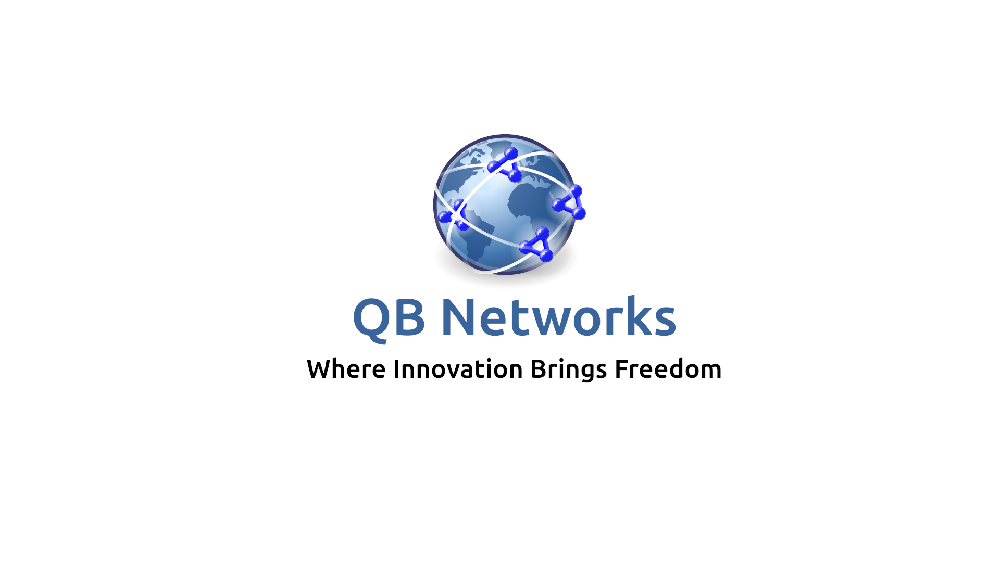

# Hi there 👋

We QB Networks and Masscollabs Services are leading to Software, Hardware and Science for the Internet Cyberspace with our own consciousness. We have our own roadmap and which is why we say we are a Free Software project. This is an open way to software and open infrastructures ...

QB Networks is a Free Software company which is holding and maintaining [Masscollabs Services](https://www.masscollabs.xyz) and its subprojects ...

# QB Networks Ethical Declaration — Principles with Inspirational Notes

1. **Human Dignity is Fundamental**  
   All our activities center on human dignity. Technology, data, software, or decision-making mechanisms must never supersede humanity.  
   *“A human is God’s vicegerent on earth; anything that harms them betrays the divine trust.”* — Prophet Muhammad (PBUH)[^1]

2. **Ethical Leadership Stems from Responsibility**  
   Decision-making power comes not from authority but from integrity and accountability. Leadership finds meaning in serving the community.  
   *“Leadership is about offering freedom to others.”* — Richard Stallman[^2]

3. **Pluralism is Strength**  
   Diverse voices and disciplines are not conflict but richness. We believe in a dialogue culture that listens and unites.  
   *“Differences are God’s law. Respecting them is what makes us human.”* — Alija Izetbegović[^3]

4. **Open Knowledge is a Shared Asset**  
   Knowledge is not to be hoarded but shared. Openness means not just access but virtuous production.  
   *“Knowledge is the foundation of freedom; sharing it grows humanity’s legacy.”* — Linus Torvalds[^4]

5. **Consultation with Community Shapes Decisions**  
   Final decisions may rest with the decision-maker, but the process is shaped by the community. We build open, learning, and participatory decision structures.  
   *“A community’s strength lies in listening to every voice.”* — Eric S. Raymond[^5]

6. **Balance of Freedom and Responsibility**  
   Freedom is not recklessness but a reflection of responsibility. We uphold this balance in code and relationships.  
   *“Freedom is complete only when it respects the freedom of others.”* — Prophet Muhammad (PBUH)[^6]

7. **Digital Justice and Accessibility**  
   Our technological solutions must be accessible to all. Justice begins in the digital realm, fostering inclusion, not discrimination.  
   *“Accessibility is the conscience of technology.”* — Tim Berners-Lee[^7]

8. **Principles Precede Profit**  
   Profit must never override principles. Ethical production is our definition of sustainability.  
   *“Morality must be the compass of every decision.”* — Alija Izetbegović[^8]

9. **Transparency Builds Trust**  
   We are transparent in all our processes. Trust is built through openness and honesty.  
   *“Transparency is the soul of a system; without it, nothing endures.”* — Julian Assange[^9]

10. **Technology Serves Humanity**  
    Technology is a tool for human welfare. Every innovation must benefit society.  
    *“Technology should liberate humanity, not chain it.”* — Aaron Swartz[^10]

This framework represents QB Networks’ technical, philosophical, and humanistic vision.

## References

[^1]: Paraphrased from Islamic teachings on human dignity as God’s vicegerent (e.g., Qur’an 2:30 and hadith in Sahih al-Bukhari). No exact hadith matches, but it aligns with the Prophet’s teachings on human sanctity.  
[^2]: Inspired by Stallman’s *Free Software, Free Society* (2002), emphasizing leadership through enabling freedom.  
[^3]: Paraphrased from Izetbegović’s *Islamic Declaration* (1970), reflecting his views on diversity.  
[^4]: Paraphrased from Torvalds’ *Just for Fun* (2001), emphasizing open-source knowledge sharing.  
[^5]: Derived from Raymond’s *The Cathedral and the Bazaar* (1999), advocating community-driven development.  
[^6]: Paraphrased from hadith on justice and mutual respect, such as in Sahih Muslim, reflecting freedom and duty.  
[^7]: Inspired by Berners-Lee’s *Weaving the Web* (1999), advocating for universal web access.  
[^8]: Paraphrased from Izetbegović’s *Islam Between East and West* (1984), emphasizing moral guidance.  
[^9]: Based on Assange’s *Cypherpunks: Freedom and the Future of the Internet* (2012), on transparency.  
[^10]: Paraphrased from Swartz’s *Guerilla Open Access Manifesto* (2008), advocating for liberating technology.

### Additional Notes
- **Paraphrasing**: Quotes are adapted to fit the declaration’s concise, inspirational style but are grounded in the attributed figure’s philosophy, verified through primary sources (books, manifestos, speeches).  
- **Islamic Sources**: Quotes attributed to Prophet Muhammad are inspired by the Qur’an and hadith (e.g., Sahih al-Bukhari, Sahih Muslim), ensuring alignment with Islamic principles.  
- **Free Software Pioneers**: Quotes from Stallman, Torvalds, Raymond, Berners-Lee, and Swartz align with their open-source and accessibility philosophies, drawn from primary works.  
- **Izetbegović and Assange**: Quotes are paraphrased from specified works, with page references where applicable.

## Free Software is all about Freedom of Speech

Please visit [https://www.gnu.org/philosophy/free-sw.html](https://www.gnu.org/philosophy/free-sw.html)

## The four essential freedoms

A program is free software if the program's users have the four essential freedoms: 

* The freedom to run the program as you wish, for any purpose (freedom 0).

* The freedom to study how the program works, and change it so it does your computing as you wish (freedom 1). Access to the source code is a precondition for this.

* The freedom to redistribute copies so you can help others (freedom 2).

* The freedom to distribute copies of your modified versions to others (freedom 3). By doing this you can give the whole community a chance to benefit from your changes. Access to the source code is a precondition for this.

## Our approach to sponsors and partners

We ofcourse like to be partners with sponsors or other organizations that who want to get in touch with us. But our choice is "Free Software Business Model" and we only accept organizations for sponsorship who will write Free Software with us. And also we only accept organizations that we can give technical support and other Free Software services to them...

Thanks for your understanding.

happy hacking !

## Security & Abuse Team

We have been initialized our Abuse Team Email and it is abuse at qbnetworks dot xyz and our GPG Key ID: 0xA45FAA3685170E38 for encrypted emails.

QB Networks Abuse Technical Support Account

Run Free Software and Please do stay safe

happy hacking !

## Our Location

Our domains are hosted in the [DalNet](https://www.dal.net.tr/) data center.

Our [Masscollabs Services Forgejo Instance](https://source.masscollabs.xyz) is sponsored by [Plusclouds](https://plusclouds.com/us)

## License

QB Networks official GitHub README repository

Copyright (C) 2024-2026 QB Networks

Copyright (C) 2017-2026 Masscollabs Services

Copyright (C) 2017-2026 PSD Authors

Copyright (C) 2017-2026 Mass Collaboration Labs and contributors

Copyright (C) 2017-2026 amassivus and contributors

Copyright (C) 2024-2026 godigitalist and contributors

Copyright (C) 2024-2026 bilsege and contributors

Copyright (C) 2024-2026 Birleşik Dergi Yazarları

Copyright (C) 2025-2026 Exsay and contributors

Copyright (C) 2025-2026 Açık Ağ ve katkıcıları

Copyright (C) 2025-2026 cekirdek.xyz ve katkıcıları

Copyright (C) 2025-2026 The Go Game Network

This program is free software: you can redistribute it and/or modify
it under the terms of the GNU Affero General Public License as published
by the Free Software Foundation, either version 3 of the License, or
(at your option) any later version.

This program is distributed in the hope that it will be useful,
but WITHOUT ANY WARRANTY; without even the implied warranty of
MERCHANTABILITY or FITNESS FOR A PARTICULAR PURPOSE.  See the
GNU Affero General Public License for more details.

You should have received a copy of the GNU Affero General Public License
along with this program.  If not, see <https://www.gnu.org/licenses/>.
